<picture>
  <source media="(prefers-color-scheme: dark)" srcset="assets/header-dark.svg">
  
</picture>

  <a href="mailto:satyam.mdya33@gmail.com">satyam.mdya33@gmail.com</a> ·
  <a href="https://www.linkedin.com/in/satyam-medya-2b2825370">LinkedIn</a> ·
  Open to data engineering internships and entry-level roles ·
  B.Tech CSE (Data Science), VIT, 2026

<picture>
  <source media="(prefers-color-scheme: dark)" srcset="assets/stats-dark.svg">
  
</picture>

<picture>
  <source media="(prefers-color-scheme: dark)" srcset="assets/stack-dark.svg">
  
</picture>

<table>
<tr>
<td width="50%" valign="top">
  <a href="https://github.com/Satyammedya33/airflow-elt-warehouse-pipeline"><picture>
    <source media="(prefers-color-scheme: dark)" srcset="assets/card-airflow-dark.svg">
    
  </picture></a>
  
</td>
<td width="50%" valign="top">
  <a href="https://github.com/Satyammedya33/realtime-retail-analytics-pipeline"><picture>
    <source media="(prefers-color-scheme: dark)" srcset="assets/card-retail-dark.svg">
    
  </picture></a>
  
</td>
</tr>
<tr>
<td width="50%" valign="top">
  <a href="https://github.com/Satyammedya33/aws-data-lakehouse-pipeline"><picture>
    <source media="(prefers-color-scheme: dark)" srcset="assets/card-lakehouse-dark.svg">
    
  </picture></a>
  
</td>
<td width="50%" valign="top">
  <a href="https://github.com/Satyammedya33/llm-redteam-safety-framework"><picture>
    <source media="(prefers-color-scheme: dark)" srcset="assets/card-llm-dark.svg">
    
  </picture></a>
  
</td>
</tr>
<tr>
<td width="50%" valign="top">
  <a href="https://github.com/Satyammedya33/ml-network-intrusion-detection"><picture>
    <source media="(prefers-color-scheme: dark)" srcset="assets/card-ids-dark.svg">
    
  </picture></a>
  
</td>
<td width="50%" valign="top">
  <picture>
    <source media="(prefers-color-scheme: dark)" srcset="assets/principles-dark.svg">
    
  </picture>
</td>
</tr>
</table>

<picture>
  <source media="(prefers-color-scheme: dark)" srcset="assets/education-dark.svg">
  
</picture>

Plain-text version

**Satyam Medya** — data engineer / data analyst. B.Tech CSE (Data Science), VIT, 2026. Open to data engineering internships and entry-level roles. [satyam.mdya33@gmail.com](mailto:satyam.mdya33@gmail.com) · [LinkedIn](https://www.linkedin.com/in/satyam-medya-2b2825370)

Five end-to-end projects, each with a pytest suite run by GitHub Actions on every push, and each runnable locally without a cloud account. Datasets are synthetic generators unless noted.

- **[airflow-elt-warehouse-pipeline](https://github.com/Satyammedya33/airflow-elt-warehouse-pipeline)** — Airflow DAG: extract → load → dbt-style SQL models → PostgreSQL star schema (3 dimensions + 1 fact), with a final quality gate (not-null, unique, range, referential integrity) that fails the run on any violation. 7 tests.
- **[realtime-retail-analytics-pipeline](https://github.com/Satyammedya33/realtime-retail-analytics-pipeline)** — Kafka stream: 60-second tumbling-window revenue, order count and AOV, plus rolling z-score anomaly detection into PostgreSQL with a Streamlit dashboard. 8 tests.
- **[aws-data-lakehouse-pipeline](https://github.com/Satyammedya33/aws-data-lakehouse-pipeline)** — bronze/silver/gold medallion lakehouse in Parquet, queried with DuckDB; Terraform provisions versioned, encrypted S3, a Glue catalog and a least-privilege IAM role; runs on local disk, LocalStack or S3. 3 tests.
- **[llm-redteam-safety-framework](https://github.com/Satyammedya33/llm-redteam-safety-framework)** — defensive LLM evaluation: 12 probes across 7 categories, deterministic canary-token and refusal-pattern scoring, HTML reports, adapters for OpenAI, Anthropic and an offline mock. 9 tests.
- **[ml-network-intrusion-detection](https://github.com/Satyammedya33/ml-network-intrusion-detection)** — Random Forest vs XGBoost on NSL-KDD-style flows (Normal/DoS/Probe/R2L), evaluated on per-class recall, confusion matrix and ROC-AUC, with a Streamlit triage dashboard. 7 tests.

**Skills** — Python, SQL, Java, C/C++ · Apache Kafka, Apache Airflow, ETL/ELT design, dbt-style SQL modelling, star-schema warehousing, data-quality validation · AWS (S3, Glue, Athena, IAM), Terraform, Docker & Docker Compose, LocalStack, GitHub Actions · pandas, NumPy, scikit-learn, XGBoost, TensorFlow, Keras · PostgreSQL, MySQL, DuckDB, Parquet/Arrow, Power BI, Excel, Jupyter · LLM/prompt-injection red-teaming, network intrusion detection, applied ML for security

Panels on this page are SVGs generated by <a href="scripts/gen_readme.py">scripts/gen_readme.py</a> — Geist (SIL OFL 1.1) subset and embedded, logos from Devicon (MIT) and Simple Icons (CC0).
