 

 

## 👋 About me

I'm a data engineer who ships **production-shaped** pipelines, not notebooks — every repo below has Docker, CI, tests, and automated data-quality gates. On the side I dig into the security half of the stack: **red-teaming LLMs** against prompt injection and building **ML classifiers for network intrusion detection**.

- 🎓 B.Tech CSE (Data Science) — Vellore Institute of Technology
- 🔭 Building: streaming, orchestrated ELT, and cloud-lakehouse pipelines with quality gates baked in
- 🛡️ Exploring: AI/LLM safety evaluation and applied ML for network security
- ⚡ Fun fact: every pipeline I ship has to survive its own test suite before it survives production

 

## 🚀 Featured builds

*Click a project to expand — architecture notes and stack are inside.*

<b>⚡ realtime-retail-analytics-pipeline</b> — streaming fraud detection on Kafka

 

Kafka-based streaming pipeline with 60-second tumbling-window aggregation and rolling z-score anomaly detection, landing into Postgres with a Streamlit dashboard on top.

`Kafka` · `Python` · `PostgreSQL` · `Docker` · `Streamlit`

**[→ View repository](https://github.com/Satyammedya33/realtime-retail-analytics-pipeline)**

<b>🏭 airflow-elt-warehouse-pipeline</b> — orchestrated ELT into a star-schema warehouse

 

Airflow-orchestrated ELT with dbt-style SQL models feeding a star-schema warehouse, gated end-to-end by automated data-quality checks.

`Airflow` · `SQL` · `Data Quality` · `CI`

**[→ View repository](https://github.com/Satyammedya33/airflow-elt-warehouse-pipeline)**

<b>🏞️ aws-data-lakehouse-pipeline</b> — medallion lakehouse on AWS

 

Bronze / Silver / Gold medallion architecture on S3, provisioned with Terraform, queried Athena-style through DuckDB.

`AWS S3` · `Terraform` · `Parquet` · `DuckDB`

**[→ View repository](https://github.com/Satyammedya33/aws-data-lakehouse-pipeline)**

<b>🛡️ llm-redteam-safety-framework</b> — probing LLMs for prompt-injection resistance

 

A defensive probe suite that scores how well an LLM resists prompt injection and jailbreak attempts, using canary-token scoring for objective pass/fail results.

`AI Security` · `Python` · `Eval Harness`

**[→ View repository](https://github.com/Satyammedya33/llm-redteam-safety-framework)**

<b>🔒 ml-network-intrusion-detection</b> — classifying network attacks

 

Random Forest / XGBoost classifiers detecting DoS, Probe, and R2L network attacks, wrapped in a Streamlit triage dashboard for analysts.

`scikit-learn` · `XGBoost` · `Streamlit`

**[→ View repository](https://github.com/Satyammedya33/ml-network-intrusion-detection)**

Every repo above ships with a working Docker/CI setup, a test suite, and a README with an architecture diagram — click through, don't take my word for it.

 

## 🧰 Tech stack

<table>
<tr><td valign="top" width="50%">

**Languages**
 

**Data engineering**
 

</td><td valign="top" width="50%">

**ML / AI / security**
 

**Tools**
 

</td></tr>
</table>

 

## 📊 GitHub analytics

 

## 🐍 Contribution graph

Generated by the workflow in <code>.github/workflows/snake.yml</code> — see the setup note below to switch it on.

 

## 🤝 Let's connect

| | |
|---|---|
| 📧 Email | [satyam.mdya33@gmail.com](mailto:satyam.mdya33@gmail.com) |
| 💼 LinkedIn | [satyam-medya](https://www.linkedin.com/in/satyam-medya-2b2825370) |
| 💬 Talk to me about | pipelines, data quality, or AI security |

Thanks for stopping by — this README is generated and interactive, click around ⬆️

