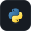
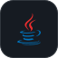

<picture>
  <source media="(prefers-color-scheme: dark)" srcset="assets/header-dark.svg">
  
</picture>

  
  
  
  

I build data pipelines the way they run in production: orchestrated, containerised, tested in CI, and guarded by data-quality checks that fail loudly. My work covers real-time streaming with Kafka, orchestrated ELT into dimensional warehouses, and Terraform-defined lakehouses on AWS. I also apply ML and evaluation tooling to security problems.

<table width="100%">
  <tr>
    <td align="center" valign="top" width="25%"><h3>5</h3>production-style pipelines</td>
    <td align="center" valign="top" width="25%"><h3>34</h3>automated tests</td>
    <td align="center" valign="top" width="25%"><h3>5 / 5</h3>repos tested in CI</td>
    <td align="center" valign="top" width="25%"><h3>0</h3>cloud accounts needed to run</td>
  </tr>
</table>

## Tech stack

<table>
  <tr>
    <td width="150"><b>Languages</b></td>
    <td align="center" width="84"> Python</td>
    <td align="center" width="84"> SQL</td>
    <td align="center" width="84"> Java</td>
    <td align="center" width="84"> C</td>
    <td align="center" width="84"> C++</td>
    <td colspan="2" width="168"></td>
  </tr>
  <tr>
    <td><b>Data engineering</b></td>
    <td align="center"> Kafka</td>
    <td align="center"> Airflow</td>
    <td align="center"> Parquet / Arrow</td>
    <td align="center"> DuckDB</td>
    <td colspan="3">ETL / ELT design · dbt-style SQL modelling · star-schema warehousing · data-quality validation</td>
  </tr>
  <tr>
    <td><b>Cloud &amp; DevOps</b></td>
    <td align="center"> AWS</td>
    <td align="center"> Terraform</td>
    <td align="center"> Docker</td>
    <td align="center"> LocalStack</td>
    <td align="center"> Actions</td>
    <td colspan="2">S3 · Glue · Athena · IAM</td>
  </tr>
  <tr>
    <td><b>Data &amp; ML</b></td>
    <td align="center"> pandas</td>
    <td align="center"> NumPy</td>
    <td align="center"> scikit-learn</td>
    <td align="center"> XGBoost</td>
    <td align="center"> TensorFlow</td>
    <td align="center"> Keras</td>
    <td align="center"> Jupyter</td>
  </tr>
  <tr>
    <td><b>Databases &amp; BI</b></td>
    <td align="center"> PostgreSQL</td>
    <td align="center"> MySQL</td>
    <td align="center"> Power BI</td>
    <td align="center"> Excel</td>
    <td colspan="3">Security: LLM prompt-injection red-teaming · network intrusion detection · applied ML for security</td>
  </tr>
</table>

## Selected work

<table>
  <tr>
    <td width="50%" valign="top">
      <h3><a href="https://github.com/Satyammedya33/airflow-elt-warehouse-pipeline">Airflow ELT Warehouse</a></h3>
      
      
Orchestrated ELT from raw operational data to a PostgreSQL star schema.

      <pre>extract → load → SQL models → quality gate</pre>
      <ul>
        <li>3 dimensions + 1 fact table built by dependency-ordered, dbt-style SQL models</li>
        <li>Final DAG task runs not-null, unique, range and referential-integrity checks, and fails the run on any violation</li>
        <li>Source data deliberately contains invalid rows, so the gate is tested against real failures</li>
      </ul>
      Airflow · PostgreSQL · SQL · Docker Compose · 7 tests
    </td>
    <td width="50%" valign="top">
      <h3><a href="https://github.com/Satyammedya33/realtime-retail-analytics-pipeline">Real-Time Retail Analytics</a></h3>
      
      
Event streaming with live metrics and in-flight anomaly detection.

      <pre>Kafka → 60s windows → z-score → Postgres</pre>
      <ul>
        <li>Revenue, order count and average order value per 60-second tumbling window</li>
        <li>Rolling z-score flags anomalous order amounts as they stream through</li>
        <li>Windowing and scoring are pure functions, unit-tested without a broker; full stack runs in Docker Compose</li>
      </ul>
      Kafka · PostgreSQL · Streamlit · Docker Compose · 8 tests
    </td>
  </tr>
  <tr>
    <td width="50%" valign="top">
      <h3><a href="https://github.com/Satyammedya33/aws-data-lakehouse-pipeline">AWS Data Lakehouse</a></h3>
      
      
Medallion lakehouse for IoT telemetry and clickstream events.

      <pre>bronze → silver → gold → DuckDB SQL</pre>
      <ul>
        <li>Terraform: versioned, encrypted S3 with public access blocked, lifecycle rules, Glue catalog, least-privilege IAM role</li>
        <li>Same code runs on local disk, LocalStack or real S3; switched by one environment variable</li>
        <li>Silver layer types data into Parquet and drops faulty sensor readings</li>
      </ul>
      Terraform · AWS · Parquet · DuckDB · LocalStack · 3 tests
    </td>
    <td width="50%" valign="top">
      <h3><a href="https://github.com/Satyammedya33/llm-redteam-safety-framework">LLM Red-Team Framework</a></h3>
      
      
Defensive harness measuring how well an LLM resists manipulation.

      <pre>probes → target → canary scoring → report</pre>
      <ul>
        <li>12 probes across 7 categories: prompt injection, jailbreaks, system-prompt extraction and more</li>
        <li>Deterministic canary-token and refusal-pattern scoring, with no LLM judge in the loop</li>
        <li>Reference reports in the repo: safe target 100% robust, leaky target 34%; adapters for OpenAI, Anthropic and an offline mock</li>
      </ul>
      Python · OpenAI / Anthropic APIs · YAML · 9 tests
    </td>
  </tr>
  <tr>
    <td width="50%" valign="top">
      <h3><a href="https://github.com/Satyammedya33/ml-network-intrusion-detection">ML Intrusion Detection</a></h3>
      
      
Classifies network flows as Normal, DoS, Probe or R2L.

      <pre>flows → features → RF / XGBoost → metrics</pre>
      <ul>
        <li>Random Forest and XGBoost compared on NSL-KDD-style flow features</li>
        <li>Per-class precision, recall and F1, confusion matrix and ROC-AUC, because a missed attack costs more than a false alarm</li>
        <li>Data source isolated in one module, ready to swap the synthetic generator for real NSL-KDD or CICIDS2017</li>
      </ul>
      scikit-learn · XGBoost · pandas · Streamlit · 7 tests
    </td>
    <td width="50%" valign="top">
      <h3>How I build</h3>
      <ul>
        <li><b>Every push is tested.</b> pytest runs in GitHub Actions on each push.</li>
        <li><b>Data quality is a gate, not a report.</b> Bad data stops the pipeline before it reaches consumers.</li>
        <li><b>Infrastructure is code.</b> Cloud resources are declared in Terraform, not clicked together.</li>
        <li><b>Anyone can run it.</b> Docker Compose, LocalStack and mock adapters mean no cloud bill or API key to evaluate the work.</li>
        <li><b>Honest data.</b> Where data is synthetic, the README says so.</li>
      </ul>
    </td>
  </tr>
</table>

## Education

**Vellore Institute of Technology** · B.Tech, Computer Science & Engineering (Data Science) · 2021 – 2026
 Data Structures & Algorithms · DBMS · Operating Systems · Computer Networks · Statistics & Probability

**Certifications:** Advanced Machine Learning & Python Bootcamp · IoT Architecture (VIT)
